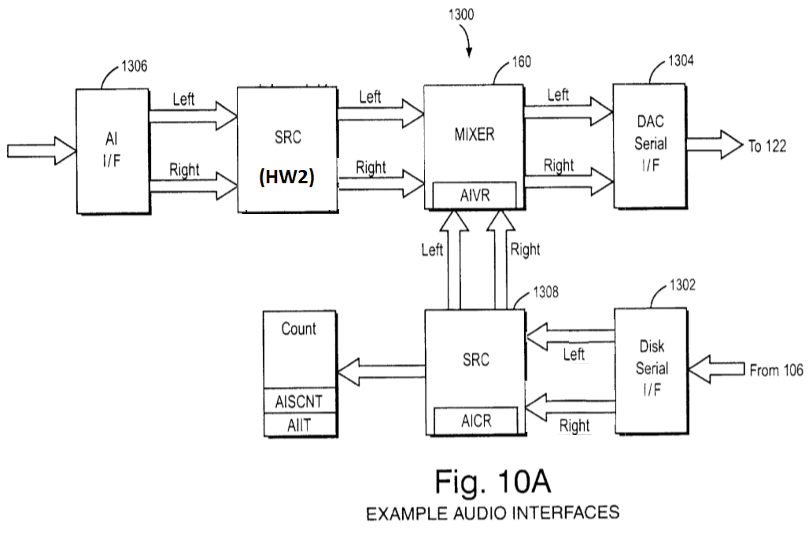
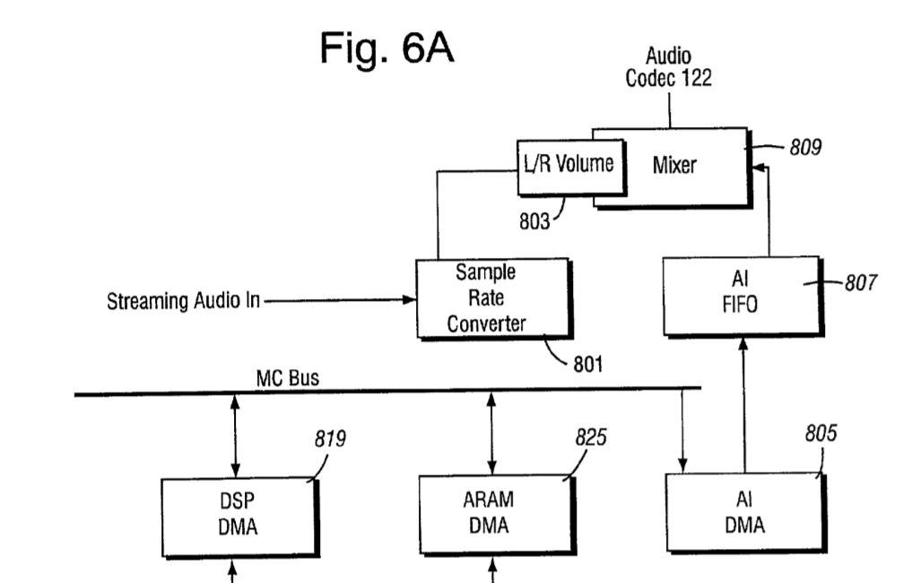
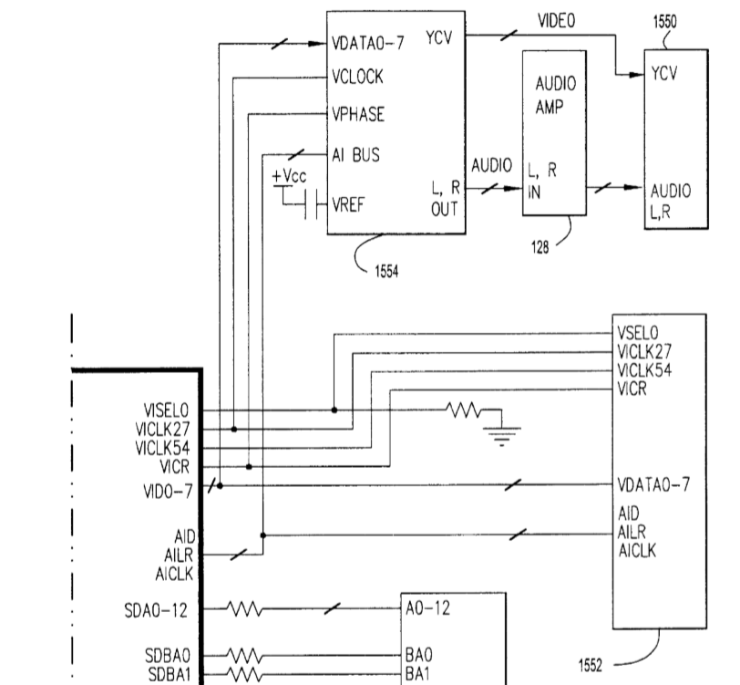

# Flipper Audio Interface (AI)

## Overview

Based on US patents 6,609,977, 7,369,665.

## Flipper AudioOut

## Signals

|Name|Dir|Type|Description|
|---|---|---|---|
|AID|O|LVCMOS|Audio Interface Data Out: AID is an output signal. AID drives the serial bit stream of the Left/Right Audio data driven out to the stereo audio DAC, synchronized by the rising edge of the bit clock AICLK and AILR signal which determines if the current word is a left sample or a right sample.|
|AILR|O|LVCMOS|Audio Interface Left Right Out: AILR is an output signal. AILR is a frame signal for the serial bit stream and determines the left/right channel of the current word. An edge of AILR also acts as a sample conversion signal to the DAC. AILR toggles at the sample rate frequency (48 kHz).|
|AICLK|O|LVCMOS|Audio Interface Clock Out: AICLK is an output signal. AICLK is the bit clock for the AID serial bit stream.|
|AISD|I|LVCMOS|Audio Interface Streaming Data: AISD is an input signal AISD is the serial bit stream of the Left Right audio data driven in from the Disk drive, synchronized by the rising edge of the bit clock.|
|AISLR|O|LVCMOS|Audio Interface Streaming Left Right: AISLR is an output signal. AISLR is a frame signal for the serial bit stream and determines the left/right channel of the current word. AISLR toggles at the sample rate frequency (32 kHz/48 kHz). This signal also controls the flow of the audio data. After this current stereo sample is received, if AISLR does not toggle, the Disk assumes that the stream is stopped/paused and sends 0’ as data. The Disk does not begin sending data until it has received a high-low-high sequence.|
|AISCLK|O|LCMOS|Audio Interface Streaming Clock: AISCLK is an output signal. AISCLK is the bit clock for the AISD serial bit stream. The AISCLK is a free running clock.|

## Audio DMA Registers

|Mnemonic|Offset|Size|Description|
|---|---|---|---|
|AID_MADRH|0x0C005030|16 bits|DMA start address (High)|
|AID_MADRL|0x0C005032|16 bits|DMA start address (Low)|
|AID_LEN|0x0C005036|16 bits|Bit15: DMA control, Bits14-0: DMA length (length of audio data in 32 Byte blocks)|
|AID_CNT|0x0C00503A|16 bits|Counts down to zero showing how many 32 Byte blocks are left|

## Audio Streaming Interface Registers

### AICR: Audio Interface Control Register

- Mnemonic: AICR 
- Offset: 0x0C006C00
- Size 32 bits

|Bits|Mnemonic|Type|Reset|Description|
|---|---|---|---|---|
|31:6| |R|0|Reserved|
|6|DFR|RW|0|Not mentioned in patent. AI DMA Sample Rate. 0: 32000 Hz, 1: 48000 Hz|
|5|SCRESET|RW|0|Sample Counter Reset: When a `1` is written to this bit the AISLRCNT register is rest to 0. Read: always 0. Write: 0 = No effect, 1 = Reset AISLRCNT register|
|4|AIINTVLD|RW|0|Audio Interface Interrupt Valid. This bit controls whether AIINT is affected by the AIIT register matching AISLRCNT. Once set, AIINT will hold its last value. 0 = March affects AIINT. 1 = AIINT hold last value.|
|3|AIINT|RW|0|Audio Interface Interrupt Status and clear. On read this bit indicates the current status of the audio interface interrupt. When a `1` is written to this register, the interrupt is cleared. This interrupt indicates that the AIIT register matches the AISLRCNT. This bit asserts regardless of the setting of AICR[AIMSK]. Write: 0 = No effect, 1 = Clear Audio Interface interrupt. Read: 0 = Audio Interface Interrupt has not been requested, 1 = Audio Interface Interrupt has been requested.|
|2|AIINTMSK|RW|0|Audio interface Interrupt Mask: 0 = interrupt masked, 1 = Interrupt enabled|
|1|AFR|RW|0|Auxiliary Frequency Register: Controls the sample rate of the streaming audio data. When set to 32 kHz sample rate, the SRC will convert the streaming audio data to 48 kHz. This bit should only be changed when Streaming Audio is stopped (AICR[PSTAT] set to 0). 0 = 32 kHz sample rate, 1 = 48 kHz sample rate
|0|PSTAT|RW|0|Playing Status: This bit enables the AISLR clock which controls the playing/stopping of audio streaming. When this bit is AISLRCNT register will increment for every stereo pair of samples output. 0 = Stop or Pause streaming audio (AISLR clock disabled), 1 = Play streaming audio (AISLR clock enabled)|

### AIVR: Audio Interface Volume Register

- Mnemonic: AIVR 
- Offset: 0x0C006C04
- Size 32 bits

|Bits|Mnemonic|Type|Reset|Description|
|---|---|---|---|---|
|31:16|  |R|0x0|Reserved|
|15:8|AVRR|RW|0x0|Auxiliary Volume Register: Controls the volume of the auxiliary sound (right channel) 0xFF is maximum volume, 0x00 is muted.|
|7:0|AVRL|RW|0x0|Auxiliary Volume Register: Controls the volume of the auxiliary sound (left channel) 0xFF is maximum volume, 0x00 is muted.|

### AISCNT: Audio Interface Sample Counter

- Mnemonic: AISCNT
- Offset: 0x0C006C08
- Size 32 bits

|Bits|Mnemonic|Type|Reset|Description|
|---|---|---|---|---|
|31:0|AISCNT|R|0x0|Audio interface Sample Counter: This register counts the number of AIS stereo samples that have been output. It is enabled by AICR[PSTAT]. It can be cleared by the AICR[SCRESET] register.|

### AIIT: Audio Interface Interrupt Timing

- Mnemonic: AIIT 
- Offset: 0x0C006C0C
- Size 32 bits

|Bits|Mnemonic|Type|Reset|Description|
|---|---|---|---|---|
|31:0|AIIT|R|0x0|Audio Interface Interrupt Timing: This register indicates the stereo sample count to issue an audio interface interrupt to the main processor. The interrupt is issued when the value of the AISLRCNT register matches the content of this register.|

## Emulation Strategies

By its nature, AI is a streaming device, that is, it is not very clear how to emulate it :P

### What we have

On the DVD side:
- LR samples from DVDs come one at a time at 32 or 48 kHz sample rate. Here immediately there is a dullness - if they come one at a time, but with different frequencies - how to give them to the mixer?
- Volume: after SRC, samples pass the Volume control. Then they get into the mixer.
- It is possible to count samples and generate interrupt when counter reach value.

From the side of AI DMA:
- Samples come in AI FIFO by 32Byte packets
- Switching the AI ​​DMA sample rate is controlled by AICR[DFR] bit (not mentioned in patent)

### Howto

DMA execution must be based on emulated Gekko ticks (TBR). Sound playback should NOT be tied to the GekkoCore - we pool the accumulated sample buffer and start the sound on the backend, when it reach limit.

That is, sound emulation is seen as follows:
- AI DMA thread feeding mixer by 32Byte chunks. DMA speed is tied to TBR (executed N Gekko ticks -> shoved another 32 bytes)
- DVD Audio working in its own thread also feeds the Mixer for 1 sample. In this case, the AIS interrupt is checked on the counter. Here you need to pre-cache ADPCM from disk, since DVD::Read from the GCM image will slow down the thing.
- Mixer simply accumulates a sample buffer (mixing AI and DVD Audio) until a critical mass is typed there (the frame length is configurable). After that, all this accumulated buffer is asynchronously shoved into the playback backend.

## Стратегии эмуляции (Rus)

По своей природе AI - потоковое устройство, то есть не очень понятно как его эмулировать)

### Что у нас есть

Со стороны DVD:
- LR-Сэмплы от DVD приходят по одному на частоте сэмплирования 32 или 48 kHz. Тут сразу возникает затуп - если они приходят по одному, но с разной частотой - как их отдавать в миксер?
- Volume: после SRC сэмплы проходят контроль Volume (громкости). После чего попадают в Миксер.
- Есть возможность считать сэмплы и сгенерировать прерывание по счетчику

Со стороны AI DMA:
- Сэмлпы приходят пачкой в AI FIFO (которое, судя по реверсу размером 32 байта)
- Переключать частоту сэмплирования AI DMA можно битом AICR[DFR]

### Как эмулировать

Выполнение DMA должно происходить с привязкой к тикам Gekko (TBR). Воспроизведение звука НЕ должно быть привязано к ядру - мы пуляем накопленный буфер сэмплов (какого размера?) и запускаем звук на бэкенде.

То есть эмуляция звука видится следующим образом:
- AI DMA работая в потоке фидит Миксер. Скорость DMA завязана на TBR (выполнили N тиков Gekko - пихнули ещё 32 байта)
- DVD Audio работая в потоке тоже фидит Миксер по 1 сэмплу. При этом проверяется прерывание AIS по счетчику. Тут нужно сделать прекэширование ADPCM с диска, так как DVD::Read побайтово из образа GCM будет тормозить (размер кэша вынесем в параметры класса)
- Миксер просто накапливает буфер сэмплов (миксуя AI и DVD Audio), пока там не наберется критическая масса (длину фрейма вынесем в параметры класса). После этого весь этот накопленный буфер асинхронно пихается в бэкенд на воспроизведение.

### Частота сэмлирования

К выбору размера буфера для проигрывания на стороне бэкенда и стратегии SRC.

- 1 секунда звука при 48000 сэмплов = 48000 * 2 (разрядность) * 2 (L/R) = 192000 байт
- 32 байта при 48000 Hz = 8 сэмплов = 0.16666(7) миллисекунд звука
- 1 секунда звука при 32000 сэмплов = 32000 * 2 * 2 = 128000 байт
- 32 байта при 32000 Hz = 0.25 миллисекунд

Так как миксер выдает всегда 48 kHz сэмплы, все расчеты будут на их основе.

Примем размер фрейма равным кадровой частоте:
- 1 кадр PAL = 40 миллисекунд ~ 240 32 байтовых блоков = 7680 байт
- 1 кадр NTSC = 33.33(3) миллисекунд ~ 200 32 байтовых блоков = 6400 байт

То есть 16 Кбайт для звукового буфера хватит с запасом.

Теперь нужно посчитать сколько нужно кэшировать блоков для SRC на частоте сэмплирования 32000 Hz.
- PAL: 160 32 байтовых блоков
- NTSC: 133 32 байтовых блоков

Таким образом в миксере будем собирать (в 32-байтовых блоках):
|Sample rate|PAL|NTSC|
|---|---|---|
|32000|160|133|
|48000|240|200|

### Что делать, если один канал выключен

Вместо сэмплов будут нули.

Переключение частоты сэмплирования хотя бы одного источника инвалидирует звуковой буфер.
