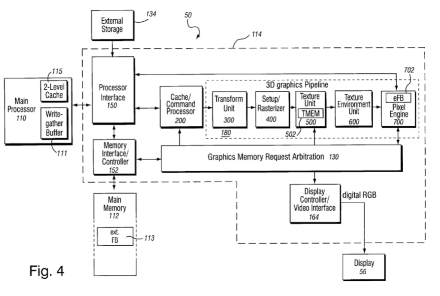
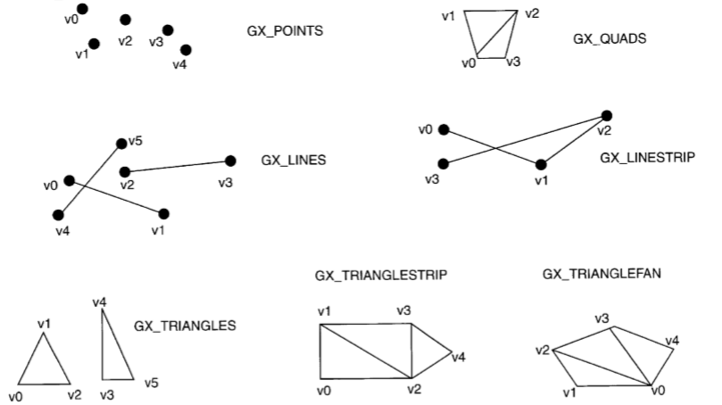

# Flipper GPU (GX)

Flipper GPU (hereinafter GX) is a graphics processor with a fixed pipeline.

GX connection with other Flipper components:



Internal GX architecture:


So that you can estimate the complexity of each GX component, here is a picture with the layout of the main areas of the Flipper chip:


Information in this document may be inaccurate and will be updated in the process.

## Gekko Write Gather Buffer

Write Gather Buffer is a small FIFO inside the Gekko processor that collects single-beat writes at the specified physical address, and when 32 bytes are collected, it passes them to Flipper as a single burst transaction.

Write Gather Buffer can be configured to any physical address. But if it is configured to the address 0x0C008000 - the burst transaction is performed using the PI FIFO mechanism: Write to the PI FIFO physical address Wrptr performed, which is then increased to 32 and PI FIFO is checked for overflow (if Wrptr becomes equal to Endptr, it is initialized with the Top value and Wrap bit is set).

### Write Pipe Address Register (WPAR)

WPAR is mapped as Gekko SPR 921.

|Bits|Name|Meaning|
|----|----|-------|
|0-26|GB_ADDR|High order address bits of the data to be gathered. The low order address bits are zero, forcing the address to be cache line aligned. Note that only these 27 bits are compared to determine if a non-cacheable store will be gathered. If the address of the non-cacheable store has a non-zero value in the low order five bits, incorrect data will be gathered.|
|27-30|-|Reserved|
|31|BNE|Buffer not empty (read only)|

Write Gather Buffer is enabled by setting a bit in the Gekko HID2 register.

## GX FIFOs

There is no normal documentation. There are only extensive descriptions of the interaction between the processor and the GX contained in the patents and documentation of the Dolphin SDK. The software interface of the GX library for working with FIFO is architecturally very poor (a poor object representation of entities was chosen; as a result, it turned out to be incomprehensible to an ordinary programmer).

There are two FIFOs: PI FIFO and CP FIFO. PI FIFO belongs to the Gekko processor and is accessible through PI registers. CP FIFO refers to the GX and is configured with its own CP registers.

Processor-GX interaction diagram using the FIFOs mechanism:


GX FIFOs can work in two modes: linked mode (immediate) and multi-buffer mode (by itself).

In linked-mode CP FIFO synchronously reads until CP Rdptr becomes equal to PI Wrptr. It also can be synchronized with the CP FIFO Watermark mechanism (see below). As stated in the patent, the Watermark mechanism only works in linked mode.

In multi-buffer mode, CP FIFO works on its own, constantly reading from the CP Rdptr address.

As you can see, when executing the display list (Call FIFO command), there must be another FIFO inside the GX that has nothing to do with the main CP FIFO.

## Processor Interface FIFO

PI FIFO is used to generate a command list. It acts as a producer.

### PI FIFO Registers

### PI FIFO Base (0x0C00300C)

|Bits|Name|Meaning|
|----|----|-------|
|31:27| |Reserved(?)|
|26:5|BASE|The value to write Wrptr after the PI FIFO overflow (when Wrptr becomes Top).|
|4:0|0|Zeroes|

### PI FIFO Top (0x0C003010)

|Bits|Name|Meaning|
|----|----|-------|
|31:27| |Reserved(?)|
|26:5|TOP|Monitors PI FIFO overflow. When Wrptr becomes Top, Wrptr is reset to Base.|
|4:0|0|Zeroes|

### PI FIFO Write Pointer (0x0C003014)

|Bits|Name|Meaning|
|----|----|-------|
|31:28| |Reserved(?)|
|27|WRAP|Set to `1` after Wrptr becomes equal to the value of Top. When is it reset?|
|26:5|WRPTR|The current address for writing the next 32 bytes of FIFO data. Writing is made when the processor performs a burst transaction at the address 0x0C008000. After write, the value is increased by 32. When the value becomes equal to Top, Wrptr is set to Base and the Wrap bit is set.|
|4:0|0|Zeroes|

As you can see, PI FIFO knows nothing about the mode in which it works: linked or multi-buffer. This logic is implemented entirely in the GX command processor.

## Internal State Registers

GX state stored in 3 sets of registers:
- CP Regs
- XF Regs
- BP Regs

Writing to registers is performed by special FIFO commands. Partially registers are mapped to physical memory.

## Vertex Cache/Command Processor FIFO

Reading FIFOs from the GX side are always set to 32 byte chunks.

### Command Processor FIFO

```
Register Name Bit Fields: Description CP_STATUS Register 834 0: FIFO overflow (fifo_count > FIFO_HICNT) 1: FIFO underflow (fifo_count < FIFO_LOCNT) 2: FIFO read unit idle 3: CP idle 4: FIFO reach break point (cleared by disable FIFO break point) CP_ENABLE Register 836 0: Enable FIFO reads, reset value is “0” disable 1: FIFO break point enable bit, reset value is “0” disable 2: FIFO overflow interrupt enable, reset value is “0” disable 3: FIFO underflow interrupt enable, reset value is “0” disable 4: FIFO write pointer increment enable, reset value is “1” enable 5: FIFO break point interrupt enable, reset value is “0” disable CP_CLEAR Register 838 0: clear FIFO overflow interrupt 1: clear FIFO underflow interrupt CP_STM_LOW Register 840  7:0 bits 7:0 of the Streaming Buffer low water mark in 32 bytes increment, default (reset) value is “0x0000” CP_FIFO_BASEL 822 15:5 bits 15:5 of the FIFO base address in memory CP_FIFO_BASE 822  9:0 bits 25:16 of the FIFO base address in memory CP_FIFO_TOPL 824 15:5 bits 15:5 of the FIFO top address in memory CP_FIFO_TOPH 824  9:0 bits 25:16 of the FIFO top address in memory CP_FIFO_HICNTL 826 15:5 bits 15:5 of the FIFO high water count CP_FIFO_HICNTH 826  9:0 bits 25:16 of the FIFO high water count CP_FIFO_LOCNTL 828 15:5 bits 15:5 of the FIFO low water count CP_FIFO_LOCNTH 828  9:0 bits 25:16 of the FIFO low water count CP_FIFO_COUNTL 830 15:5 bits 15:5 of the FIFO_COUNT (entries currently in FIFO) CP_FIFO_COUNTH 830  9:0 bits 25:16 of the FIFO_COUNT (entries currently in FIFO) CP_FIFO_WPTRL 808 15:5 bits 15:5 of the FIFO write pointer CP_FIFO_WPTRH 808  9:0 bits 25:15 of the FIFO write pointer CP_FIFO_RPTRL 804 15:5 bits 15:5 of the FIFO read pointer CP_FIFO_RPTRH 804  9:0 bits 25:15 of the FIFO read pointer CP_FIFO_BRKL 832 15:5 bits 15:5 of the FIFO read address break point CP_FIFO_BRKH 832  9:0 bits 9:0 if the FIFO read address break point
```

### FIFO Command Format

```
Opcode Opcode(7:0) Next Followed by NOP 00000000 none none Draw_Quads 10000vat(2:0) VertexCount(15:0) Vertex attribute stream Draw_Triangles 10010vat(2:0) VertexCount(15:0) Vertex attribute stream Draw_Triangle_strip 10011vat(2:0) VertexCount(15:0) Vertex attribute stream Draw_Triangle_fan 10100vat(2:0) VertexCount(15:0) Vertex attribute stream Draw_Lines 10101vat(2:0) VertexCount(15:0) Vertex attribute stream Draw_Line_strip 10110vat(2:0) VertexCount(15:0) Vertex attribute stream Draw_Points 10111vat(2:0) VertexCount(15:0) Vertex attribute stream CP_LoadRegs 00001xxx Address[7:0] 32 bits data (for CP only registers) XF_LoadRegs 00010xxx none (N+2)*32 bits (This is used for First 32 bit: loading all XF 15:00 register address in XF registers, including 19:16 number of 32 bit registers to be matrices. It can be loaded (N+1, 0 means 1. 0xff means 16) used to load matrices 31:20 unused with immediate data) Next N+1 32 bits: 31:00 register data XF_IndexLoadRegA 00100xxx none 32 bits (registers are in the 11:0 register address in XF first 4K address space 15:12 number of 32 bit data, (0 means 1, of the XF. It can be 0xff means 16) used to block load matrix and light 31:16 Index to the register Array A registers) XF_IndexLoadRegB 00101xxx none 32 bits (registers are in the 11:0 register address in XF first 4K address space 15:12 number of 32 bit data, (0 means 1, of the XF. It can be 0xff means 16) used to block load 31:16 Index to the register Array B matrix and light registers) XF_IndexLoadRegC 00110xxx none 32 bits (registers are in the 11:0 register address in XF first 4K address space 15:12 number of 32 bit data, (0 means 1, of the XF. It can be 0xff means 16) used to block load 31:16 Index to the register Array C matrix and light resisters) XF_IndexLoadRegD 00111xxx none 32 bits (registers are in the 11:0 register address in XF first 4K address space 15:12 number of 32 bit data, (0 means 1, of the XF. It can be 0xff means 16) used to block load 31:16 Index to the register Array D matrix and light registers) Call_Object 01000xxx none 2x32 25:5 address (need to be 32 byte align) 25:5 count (32 byte count) V$_Invalidate 01001xxx none none SU_ByPassCmd 0110,SUattr(3:0) none 32 bit data (This includes all the register load below XF and all setup unit commands, which bypass XF)
```

### Vertex Cache

## Transform Unit (XF)

## Setup/Rasterizer (SU/RAS)

The rasterizer(s) is able to draw the following graphic primitives:



## Texture Unit

## Texture Cache (TMEM)

## Texture Environment Unit (TEV)

## Embedded Frame Buffer (EFB)

### Color/Z Compare (C/Z)

### Pixel Engine / Copy (PE)

## GX Verify
