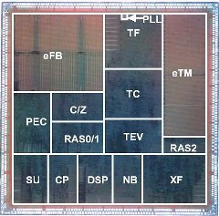

# Flipper GPU (GX)

Flipper GPU (hereinafter GX) is a graphics processor with a fixed pipeline.

GX connection with other Flipper components:

Internal GX arhitecture:

So that you can estimate the complexity of each GX component, here is a picture with the layout of the main areas of the Flipper chip:

## Gekko Write Gather Buffer

Write Gather Buffer is a small FIFO inside the Gekko processor that collects single-beat writes at the specified physical address, and when 32 bytes are collected, it passes them to Flipper as a single burst transaction.

Write Gather Buffer can be configured to any physical address. But if it is configured to the address 0x0C008000 - the burst transaction is performed using the PI FIFO mechanism: Write to the PI FIFO physical address Wrptr performed, which is then increased to 32 and PI FIFO is checked for overflow (if Wrptr becomes equal to Endptr, it is initialized with the Top value and Wrap bit is set).

### Write Pipe Address Register (WPAR)

WPAR is mapped as Gekko SPR 921.

|Bits|Name|Meaning|
|----|----|-------|
|0-26|GB_ADDR|High order address bits of the data to be gathered. The low order address bits are zero, forcing the address to be cache line aligned. Note that only these 27 bits are compared to determine if a non-cacheable store will be gathered. If the address of the non-cacheable store has a non-zero value in the low order five bits, incorrect data will be gathered.|
|27-30|-|Reserved|
|31|BNE|Buffer not empty (read only)|

Write Gather Buffer is enabled by setting a bit in the Gekko HID2 register.

## Processor Interface FIFO

## Cache/Command Processor FIFO

## Internal State Registers

GX state stored in 3 sets of registers:
- CP Regs
- BP Regs
- XF Regs

Writing to registers is performed by special FIFO commands. Partially registers are mapped to physical memory.

## Transform Unit (XF)

## Setup/Rasterizer (SU/RAS)

## Texture Unit

## Texture Cache (TMEM)

## Texture Environment Unit (TEV)

## Embedded Frame Buffer (EFB)

### Color/Z Compare (C/Z)

### Pixel Engine / Copy (PE)
